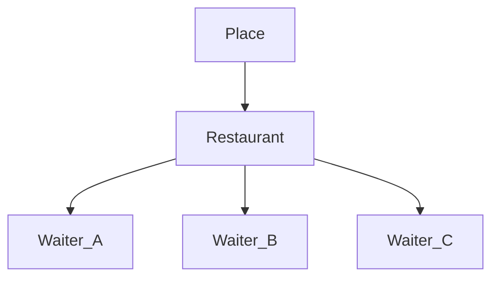
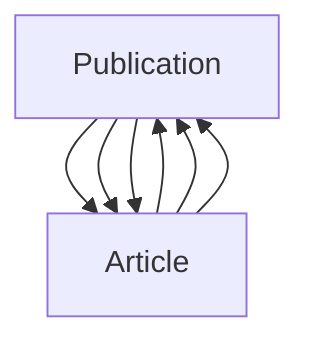

# **ORM (Object Relation Mapping)**

-  The ORM’s main goal is to transmit data between a relational database and application model. The ORM automates this transmission, such that the developer need not write any SQL.

- Example :

OPERATION | SQL | ORM |
:---:|:---:|:---:|
|RETRIVE| SELECT * FROM Student;|Student.objects.all() |
|INSERT| INSERT INTO User VALUES ("Angappan","Password"); | Student.objects.create(name="Angappan",password="Password")|
|UPDATE| UPDATE Student SET name="Mani" WHERE id=1; | Student.objects.filter(id=1).update(password="12345")|
|DELETE| delete from Student where id = 1; |SomeModel.objects.filter(id=id).delete()|

## __Scenario 1 :__ Current DB Engine (SQL)

## SQL (Retrive)

- SELECT * FROM user;

## ORM (Retrive)
- User.objects.all();

## __Scenario 2 :__ Current DB Engine (Postgres)

## ORM (Retrive)
- User.objects.all();

`Note: Whenever backend database engine changes don't have to modify ORM Queries but to change connection string in settings.py`


# Relationships in Django ORM

## __one-to-one Relation__ :

```python
from django.db import models

class Place(models.Model):
    name = models.CharField(max_length=50)
    address = models.CharField(max_length=80)

    def __str__(self):
        return "%s the place" % self.name

class Restaurant(models.Model):
    place = models.OneToOneField(
        Place,
        on_delete=models.CASCADE,
        primary_key=True,
    )
    serves_hot_dogs = models.BooleanField(default=False)
    serves_pizza = models.BooleanField(default=False)

    def __str__(self):
        return "%s the restaurant" % self.place.name

class Waiter(models.Model):
    restaurant = models.ForeignKey(Restaurant, on_delete=models.CASCADE)
    name = models.CharField(max_length=50)

    def __str__(self):
        return "%s the waiter at %s" % (self.name, self.restaurant)
```





## __many-to-many Relation__ :

```python
from django.db import models

class Publication(models.Model):
    title = models.CharField(max_length=30)

    class Meta:
        ordering = ['title']

    def __str__(self):
        return self.title

class Article(models.Model):
    headline = models.CharField(max_length=100)
    publications = models.ManyToManyField(Publication)

    class Meta:
        ordering = ['headline']

    def __str__(self):
        return self.headline
```




